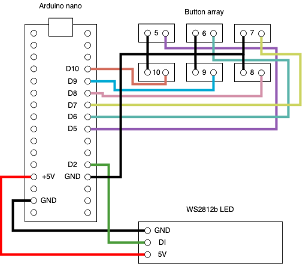

# arduino_screenbar
Basically the code for WS2812b LEDs controlled with mechanical switches.

Mapping:\
`05` `06` `07`\
`10` `09` `08`

Functions:
+ `05`: Brightness up
+ `06`: On/Off
+ `07`: Brightness down
+ `10`: Temperature down
+ `09`: Reset temperature
+ `08`: Temperature up

Schematic:\

